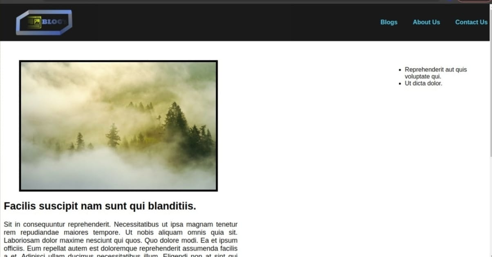

# Blog Rendering #

**BLOG RENDERING** is a project in which we have a blog page which has image title and paragraph and related links to other blogs on which if you clicked you will bew directed to new blog we are getting data from json file using get

Content

- **index.html**-this files contain basic markup with javascript and css file linked to it.
- **style.css**-this files contain all the style for blog content navigation bar and hamburger and footer.
- **src**-this is javascript folder in which we have created modules and are imported in main.js which is linked to html page.

  **helper**-this is javascript folder in src folder which has all the functioning of blog files in it.

  **components**-this is javascript folder in which
tps://dishant45.github.io/blog-rendering/index.html

